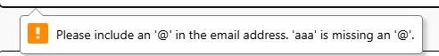
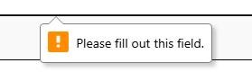
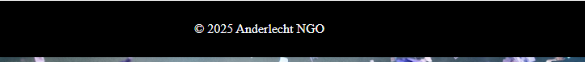
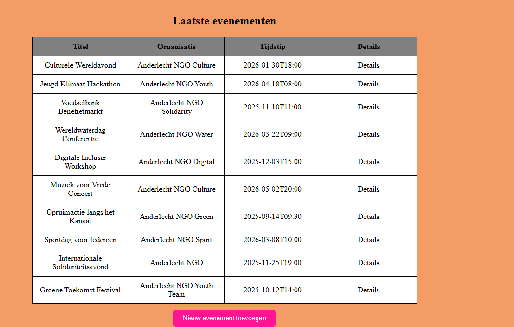
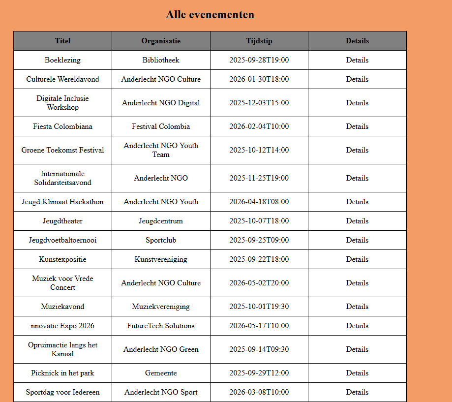
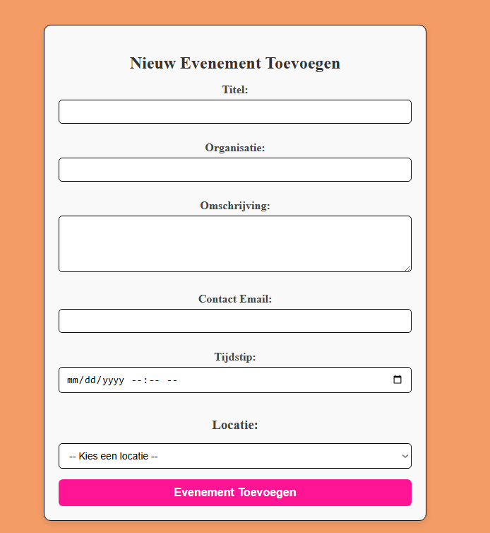
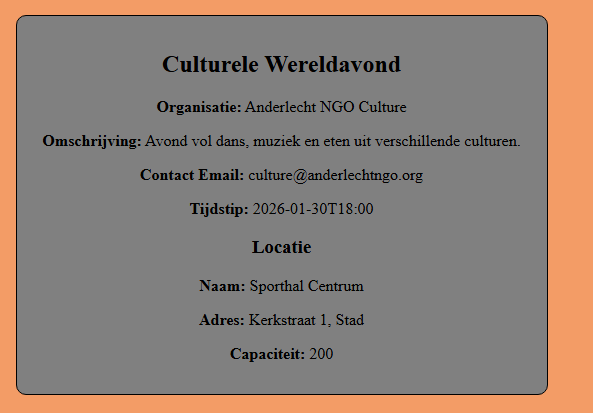
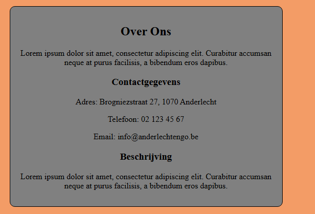

# Webapp voor Anderlechtse NGO

---

## 📄 Beschrijving van het project

Deze webapp is een prototype voor een Anderlechtse NGO die zich inzet voor gemeenschapsprojecten en hulp aan mensen die het minder breed hebben.

**Doel van de webapp:**
- Overzicht van evenementen weergeven
- Beheer van evenementen vergemakkelijken

**Pagina’s in de webapp:**
- **Evenement** – Laatste 10 evenementen
- **Alle evenementen** - overzicht van alle evenementen
- **New** – Formulier voor nieuw evenement
- **Details** – Detailpagina per evenement
- **About** – Algemene informatie over de NGO

---

## 💻 Gebruikte technologieën

- **Frontend:** HTML, CSS
- **Backend /:** Java
- **Data opslag:** WSL, MySQL

---

## 🛠 Structuur van de API

**Endpoints:**

| Endpoint        | Methode | Functie                                                     |
|-----------------|---------|-------------------------------------------------------------|
| `/`             | GET     | Haal de laatste 10 evenementen op en toon op de indexpagina |
| `/details/{id}` | GET     | Haal details van een specifiek evenement op via ID          |
| `/new`          | GET     | Toon formulier om een nieuw evenement aan te maken          |
| `/new`          | POST    | Verwerk het formulier voor een nieuw evenement en sla op    |
| `/alle`         | GET     | Haal alle evenementen op en toon gesorteerd op titel        |
| `/about`        | GET     | Toon de "About" pagina van de NGO                           |

**Validatie:**
- Alle velden zijn verplicht
- E-mail moet geldig zijn


- Bij foutieve input wordt een foutmelding getoond



**Data voorbeeld:**
```
{
  "id": 1,
  "title": "Buurtfeest Anderlecht",
  "organization": "Eigen beheer",
  "email": "contact@ngo.be",
  "date": "2025-08-30T18:00",
  "locationId": 2,
  "description": "Lorem ipsum dolor sit amet."
}
```
---
## 🧭 Navigatie en functionaliteiten

- **Header:** - Menu: titel Anderlecht NGO (linkt naar evenement), Alle evenementen, New, About
    
- **Footer:** - Simpel copyright onderaan

- **Evenement:** - Tabel met 10 laatste evenementen + link naar details

- **Alle evenementen:** - Overzicht van alle evenementen, gesorteerd op titel

- **New:** - Formulier om nieuw evenement toe te voegen, met input validatie

- **Details pagina:** - Toont alle informatie van een geselecteerd evenement

- **About pagina:** - Algemene info over de NGO (fictief)


## 📚 Gebruikte bronnen
- **AI hulp: ChatGPT** [```https://chatgpt.com/share/68a0e857-2e9c-800b-a42f-02ffe6e6e250 ```]  en [```https://chatgpt.com/share/68a0e8b0-1b98-800b-b1e4-19e81067c33b ```]
- **Afbeeldingen: Unsplash** [```https://unsplash.com/photos/people-partying-with-confetti-ZODcBkEohk8```]

## 🤖 Hulpbronnen en AI-ondersteuning

Alle code en logica in dit project zijn door mijzelf geschreven.  
ChatGPT werd gebruikt als adviesbron en ondersteuning bij:

- Oplossen van bugs in de code
- Advies en voorbeelden voor specifieke functionaliteiten
- Verbeteren van leesbaarheid en structuur

